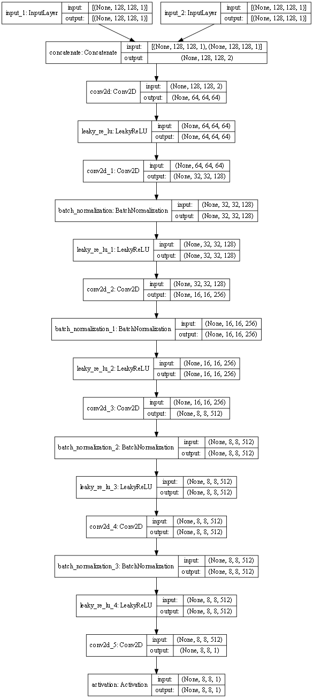
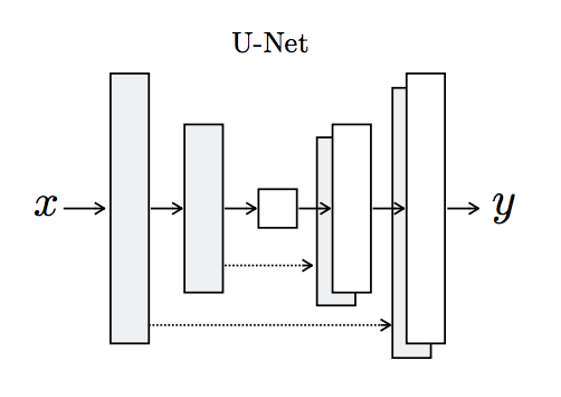
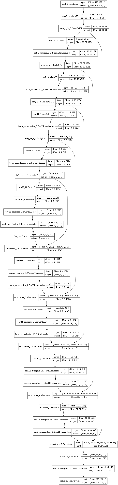

# pix2pix GAN model

@Author Xiaoyu Liu
@Date April 3, 2021
@Version GAN/OD_FFT_2

## The Goals
Predict OD FFT MEAN from a single shot of OD FFT.

## Model Spec
Input image shape: (128,128,1)
Output image shape: (128,128,1)

Input image intensity range: (-1,1)
Output image intensity range: (-1,1)

## Model Structure
This is a GAN model, which a **descriminator** and a **generator**. 

The generator trains on (input, output) pairs. It trys to generate a prediction of output based on input.

The descriminator trys to tell if a given output is generated based on the given input or real.

### The Descriminator
Input shape: [(128,128,1),(128,128,1)] (two images)
Output shape: (8,8,1)

Discriminator uses a series of convolution, batch normalization and leaky ReLU to reduce dimension.

### The Generator
Input shape: (128,128,1)
Output shape: (128,128,1)

Generator uses a series of encoders and decoders to compress the input to (2,2,1) and then expand it to (128, 128, 1).

Interconnected Layers allow the transfer of information at different scales.

See 

## Data Preprocessing

The loaded OD image has shape (300, 300, 1),
and range (-inf, inf). Most of the data is clustered around (-0.2,0.2).

### Input Dimension
We use an auto trap detection algorithm to crop an OD image into a subimage of its trap region. 

Although the input is always 300 * 300, the trap region doesn't have a fixed size. However, in each batch we have the same trap region, hence a fixed trap image size.

### Calculating OD FFT
We calculate the series of OD fft and OD fft mean based on trap images.

### Cropping trap region

Then we crop the trap image FFT to a square, by taking its shorter side as the side of square. In the cropping process, the center (zero frequency) remains at the center.

Then we resize it to (128,128,1) by removing excess region, or filling the outer border with the mean of boundary.

## Using the prediction result

### Standardization

Standard the input OD FFT image to the range [-1,1]. 
We store the relevant parameters in the standardization process.

### Prediction

### De-Standardization / Restoration

We use knowledge about the standardization process to revert the standardization process in generated prediction. This yields a prediction of OD FFT MEAN.